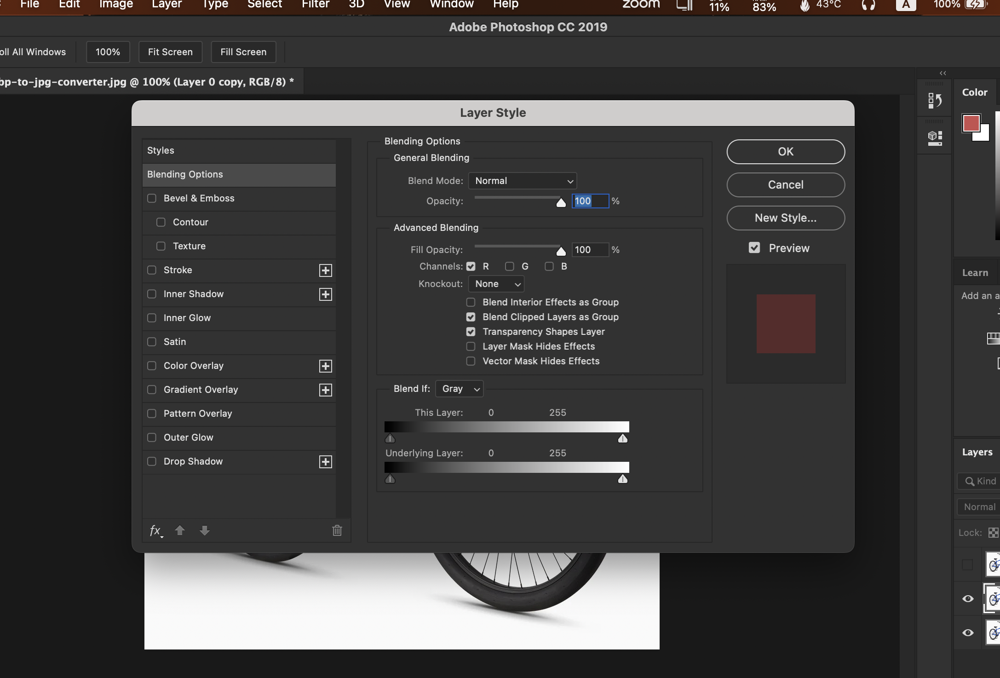
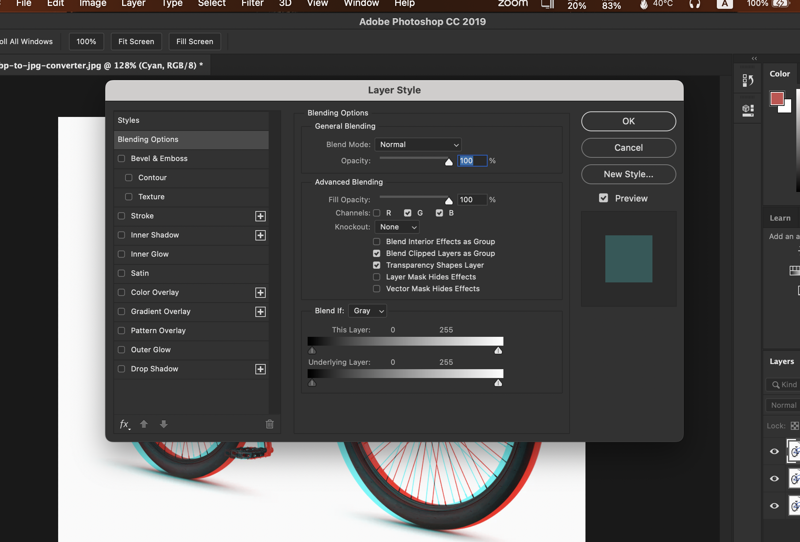
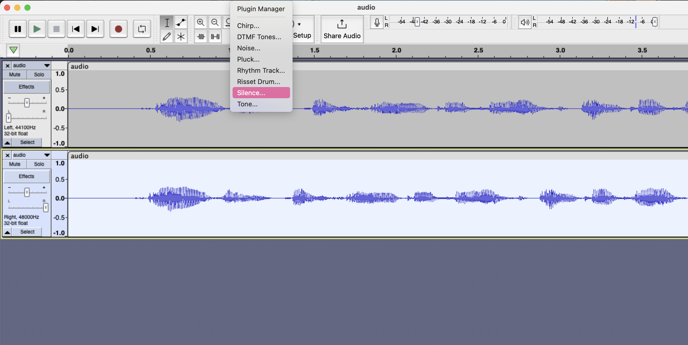
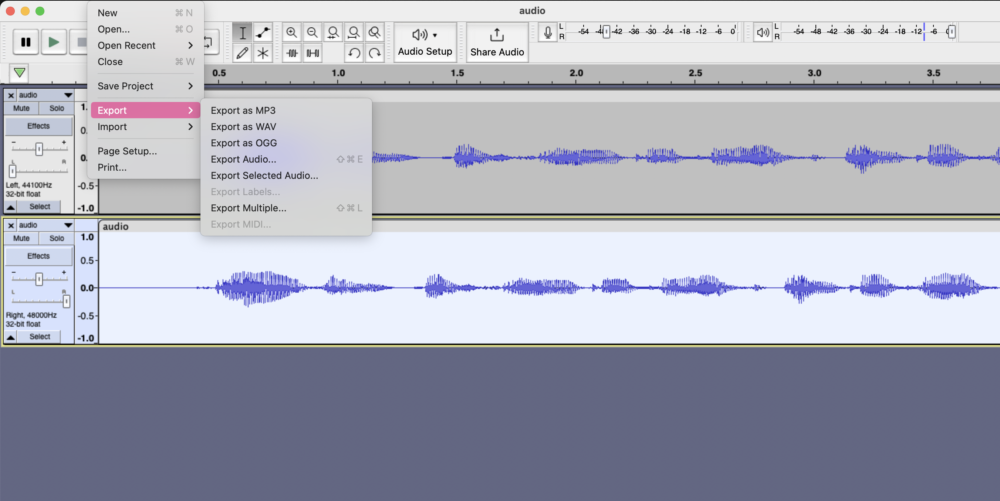

## Table of contents

In the dynamic world of audio and visual entertainment, 3D technology has brought about fascinating innovations in both sound and images. To truly appreciate the enchantment of 3D sound and visuals, let's discover the fascinating realms of stereoscopic imagery and stereo sound.

## Creating 3D Magic with Anaglyph: A Photoshop Adventure

Now, let's explore Anaglyph, a nifty technique that gives your images an extra dimension. In the world of Photoshop, the magic occurs with the three colour channels: Red, Green, and Blue (RGB). By tweaking these channels, you can make the Anaglyph effect. It uses two different-coloured filters, usually red and cyan, to blend two separate images into one. The result? A 3D image that looks like it's coming out of your screen.

## Two common methods to create 3D effects are:

1. **Anaglyph:** This method utilizes two different-coloured filters, usually red and cyan, to superimpose two separate images. To fully experience the 3D effect, we need special glasses with corresponding filters.

2. **Head-Mounted Displays (HMD):** HMDs offer a highly immersive 3D experience by presenting separate screens for each eye. They are commonly used in virtual reality systems and gaming.

## Examples of how to create Anaglyph 3D Images:

First of we need to create 2 copies of our original Image, and then switch off the Channels of the Green, and Blue to create the effect step of our 3D effect.

---

Then we need to switch off the Channels of the Red to create the second effect of our 3D effect.

---

Here is the final result of our 3D effect.

---

We can do the same with various images, and here are some examples:

Before the 3D effect:

---

After the 3D effect:

---

## Sound in 3D: A World of Possibilities

The essence of 3D sound can be broken down into the following principles:

1. **Mono vs. Stereo Sound:** Mono sound is what we commonly hear from a single speaker – it's like a solo act. But in stereo sound, you have two distinct audio tracks. This is often referred to as "dual mono," where each track may contain different sounds or may be subtly varied to create a sense of space.

2. **Spatial Enhancement and Surround Sound:** Surround sound systems aim to recreate an immersive audio experience. They want you to feel like you're in the centre of the action, where sounds come from different directions. This enhances the sense of immersion in movies and games.

3. **3D Sound and Virtual Reality:** When you put on a virtual reality headset, you enter a world where 3D sound can make your experience even more real. Sounds shift with your head movements and location within the virtual environment, further pulling you into the digital realm.

**Psychology of Sound and Image in 3D: Understanding Our Dual Sensory Perception**

The psychology of 3D technology draws heavily from our natural ability to perceive depth and direction through both vision and hearing. In the visual domain, the use of stereoscopic images, stereograms, and anaglyph techniques mimics the way our two eyes work together to provide depth perception. Each eye captures a slightly different perspective, and when combined, these images create a three-dimensional experience akin to real-world vision.

Similarly, in the auditory realm, our two ears play a crucial role in locating the source of sounds. The use of stereo sound, surround sound, and 3D sound technologies mirrors our binaural hearing process. By presenting different audio tracks or manipulating sound sources, these technologies enhance our sense of immersion, replicating the way we naturally perceive sounds from various directions in the physical world.

The parallel between vision and hearing becomes more apparent in experiments where covering one eye or blocking one ear demonstrates the significance of having two sensory inputs. This fundamental understanding of binocular vision and binaural hearing forms the basis for the development and effectiveness of 3D technologies in both the audio and visual domains.

In essence, the psychology of 3D sound and image is grounded in the principles of our dual sensory perception, The harmony between our vision and hearing creates a profound sensory experience. The technologies employed aim not only to replicate these natural processes but also to capitalize on the brain's ability to integrate visual and auditory cues, providing a more immersive and convincing multimedia experience.

## The Haas Effect: A Simple Trick for Enhanced Sound

Let's consider a straightforward example. Imagine you're listening to a voice recording, and it sounds somewhat dry and centralized. You can transform this by using the Haas Effect, which involves introducing a slight delay on one side of the stereo audio. This simple trick creates a sense of space and direction without adding complexity to the sound.

## The steps on How to make Haas Effect:

First of all, we need to open the audio file in Audacity.

---

Then we need to duplicate the audio track to create the effect, and set the first track to the left, and the second track to the right for the audio channels, And from Generate tab we select the Silence option.

---

Then set it to 0.002 seconds as the delay time.

---

Finally, we can export the audio file to save the changes, and we can listen to the audio before and after the effect.

---

The Sound Before:

<audio style="width: 100%;" controls>
  <source src="/blogs/exploring-3d-sound-and-images-a-journey-into-haas-and-anaglyph/audio-before.mp3" type="audio/mp3">
  Your browser does not support the audio element.
</audio>

The Sound After:

<audio style="width: 100%;" controls>
  <source src="/blogs/exploring-3d-sound-and-images-a-journey-into-haas-and-anaglyph/audio-after.mp3" type="audio/mp3">
  Your browser does not support the audio element.
</audio>

---

**References:**

1. WebFX. "Creating 3D Anaglyph Images in Photoshop. [Online] Available at [https://www.webfx.com/blog/web-design/3d-anaglyph-photoshop] (Accessed: [Oct.2021]).

2. Easy Photoshop 3D Effect in 30 Seconds | 3D Glasses Effect
   [Online] Available at [https://www.youtube.com/watch?v=EOpWt-ivloQ] (Accessed: [Oct.2017]).

3. An Introduction to 3D Audio Technology [Online] Available at: [https://www.highfidelity.com/blog/introduction-to-3d-audio-technology] (Accessed: [Apr.2021]).

4. mono vs stereo audacity (Sound Editing Basics: Audacity: Creating Sound
   ). [Online] Available at [https://resourceguides.hampshire.edu/c.php?g=872054&p=6262215] (Accessed: [Jun.2022]).
