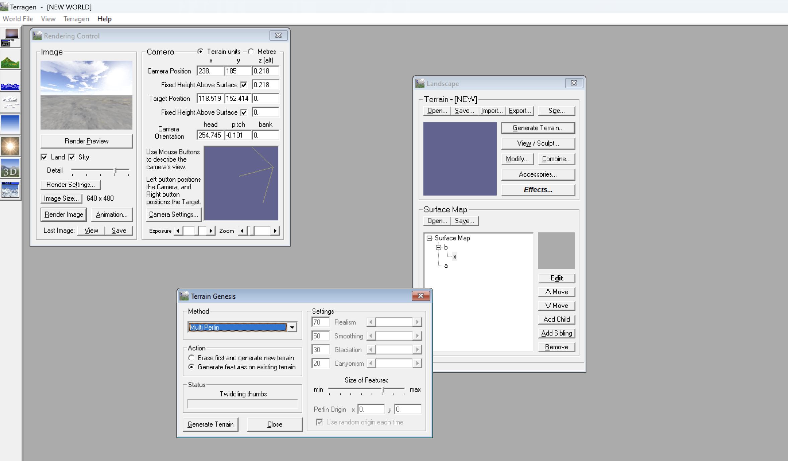
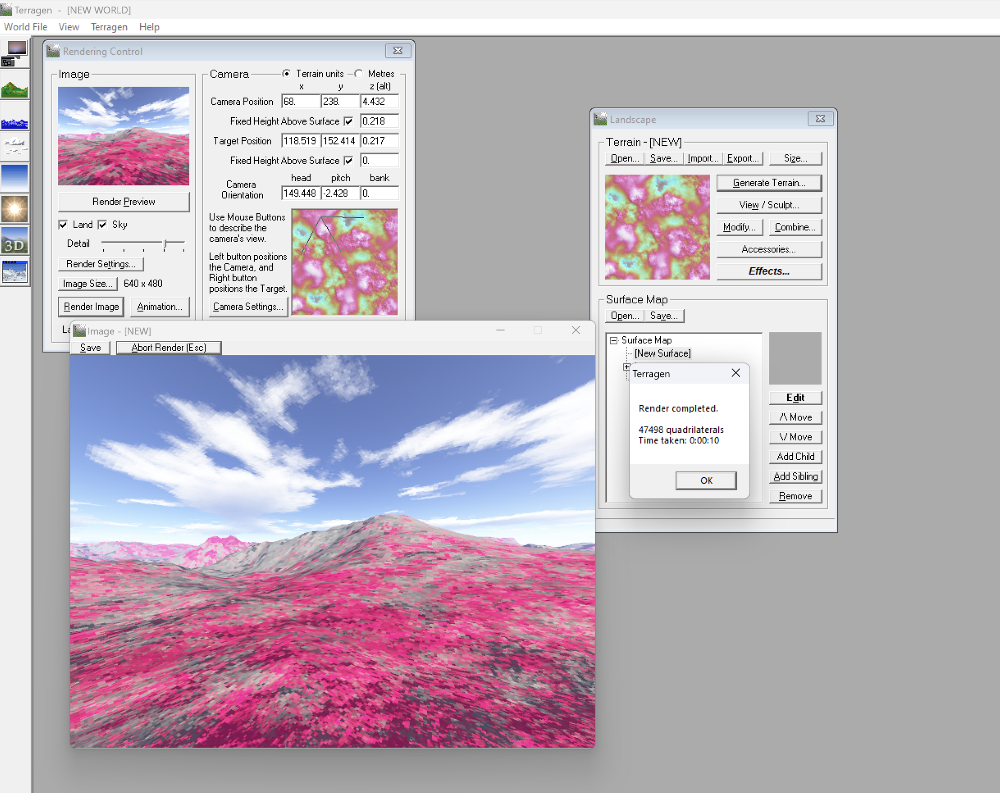
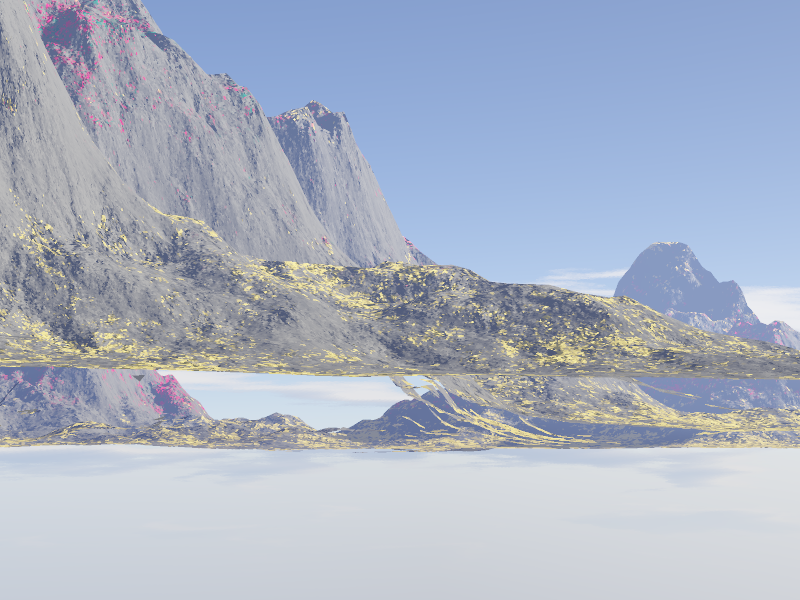
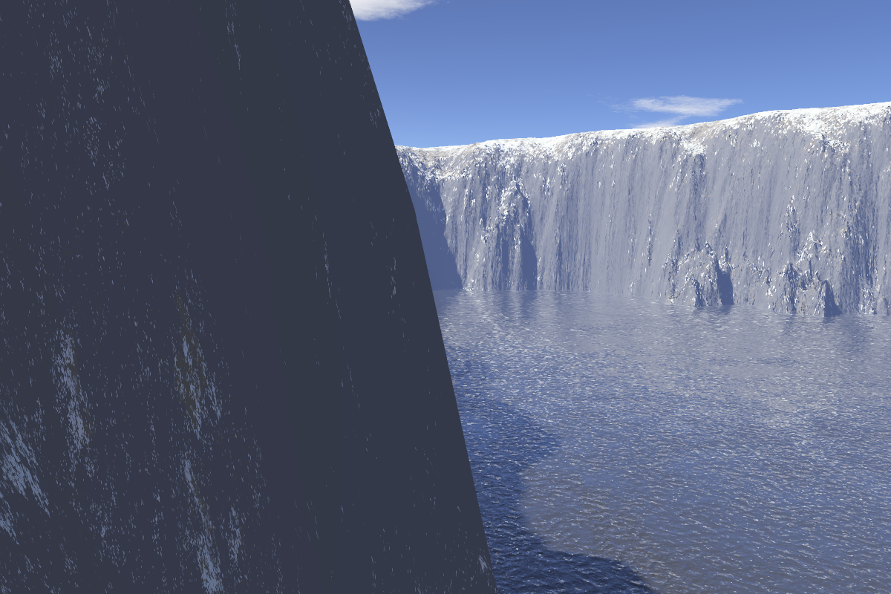

## Table of contents

## Introduction

The objective is to create a diverse portfolio of synthesized landscapes, ranging from photorealistic to otherworldly vistas. In this article we explore our adventures, with Terragen and the importance of creating a collection of synthesized landscapes ranging from realistic to fantastical views.

## Terragen Software

Our journey commenced with grasping the principles of Terragen software. Operating within a realm the software empowers us to manipulate landscapes from viewpoints. It commences by establishing the observers standpoint as the foundation for all computations turning the environment into a canvas for expression. Matrices allow us to depict object positions in three space facilitating transformations such, as rotation and scaling.

## Some of the Images Generated by Terragen:

### Perlin Noise Image

---

### Render Preview

---

### Adding a Child Layer

---

### A rendered Image with the Child Layer

---

I can generate a different image from creating "Child Layers", it allows me to add an interesting variant to the pre-rendered image, I can modify a lot of settings which nice, such as the distribution of the coverage and bumpiness, for example:

---

It would also add more life to the rendered image if I can modify the colours of the layer, so it would be unique and has a more interesting view, for example:

---

I also aimed to change the condition of lighting, as you can see here I can modify the colour of the sun, direction, and sunlight strength, After some trial and error, I made these adjustments and modified the colour of the sun, direction, and sunlight strength, for example:

---

### Water Level

---

At the end we can render these beautiful mountains, generating the feel of grass, the green land and the sun shining towards the hills is magnificent and I liked it:

The Result after adding the Water Level to the Rendered Image is amazing, it adds a lot of life to the image, and it looks more realistic, for example:

So I played around with the settings and I was able to generate a different image, I changed the water level, and Made "Ice on Top of the mountain", and the result was amazing, for example:

---

## The Mystery of Perlin Noise and Fractals

Terragens ability to create landscapes is rooted in the Perlin noise. This algorithm uses interpolated vectors to generate random variations, in space and time mimicking natural occurrences. Originally developed by Ken Perlin for creating textures in the movie "Tron " it has earned recognition, including an Academy Award in 1997.

## The Importance of Image Synthesis

In a world the capability to produce images ranging from ultra realistic to surreal and fantastical is more essential than ever. By employing efficient models we can reproduce natural phenomena making image synthesis a crucial component of contemporary digital media creation.

## Conclusion

To sum up Terragen serves as an example of the impact of image synthesis, in the hands of artists. Exploring this tool has been a journey showcasing that the realms of creativity and technology are continuously expanding. As we delve further into this field we anticipate the opportunities that image synthesis offers and how it will influence our digital environment in the future.

**References:**

1. Perlin noise. [Online] Available at [https://en.wikipedia.org/wiki/Perlin_noise#:~:text=Perlin%20noise%20is%20a%20type,the%20creation%20of%20image%20textures] (Accessed: [Sep.2023]).

2. Image Synthesis. [Online] Available at [https://www.sciencedirect.com/topics/computer-science/image-synthesis] (Accessed: [2020]).

3. Terragen Classic Basics for Windows [Online] Available at [https://www.naturescapes.net/articles/techniques/terragen-classic-basics-for-windows/] (Accessed: [Mar.2010]).
