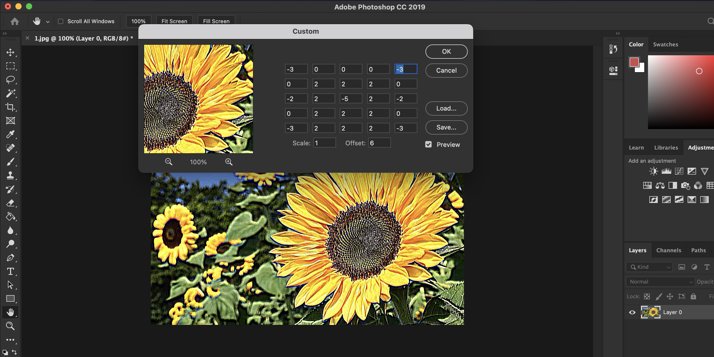
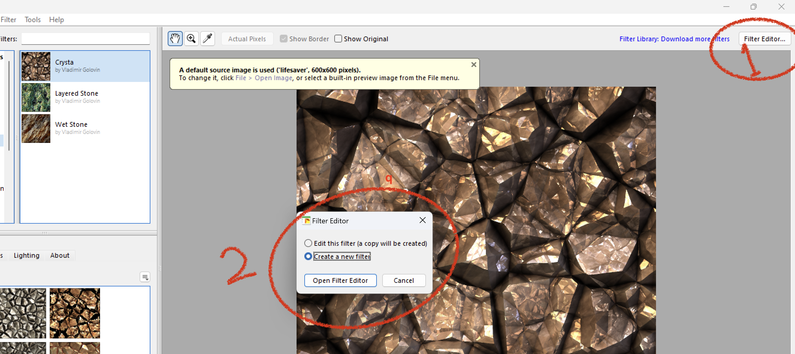
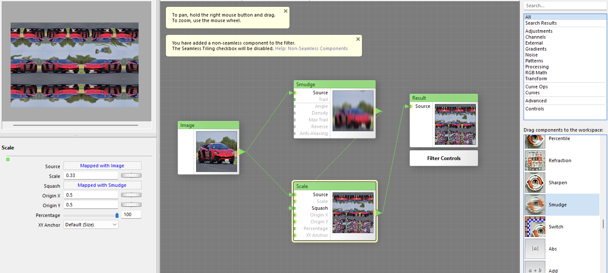

## Table of contents

## Image Filter Design: A Dive into Convolution

Image filters play a big part in a lot of applications, enhancing visual data for improved analysis and interpretation. One application is convolution, which involves processing pixels based on neighbouring pixel values. This article dives into the design and application areas of image filters, exploring pixel group processing filters, Gaussian filters, Laplacian filters, Sobel filters, and custom filters.

## How it Works

In pixel group processing, all values act as multipliers, with the centre pixel being the one under process. The scale is determined by the sum of all weights, and offsets come into play when the sum is 0. For instance, an offset of 255 inverts the image when the sum is -1.

## Gaussian Filters

Gaussian filters introduce a blur that diminishes as it moves away from the centre pixel. This type of filter is commonly used for smoothing and reducing noise in images.

## Basics – Simple Manipulation

In image manipulation basics, altering the Red, Green, and Blue values is achieved through multiplication. For example, Red _ 1.5 increases the red value, while Green _ 0.7 reduces the green amount.

## Convolution

Convolution involves using a pixel's neighbours to calculate its new value, incorporating a weighting value. This technique is widely used for blurring, sharpening, edge detection, enhancement, and embossing in images.

## Depth Perception and Binocular Vision:

When we look at an object, each eye captures a slightly different view due to their separation, known as binocular disparity. This subtle difference in perspective allows our brain to triangulate the distance of objects in the visual field. The brain then seamlessly combines these distinct images, integrating the variations in angle and position to construct a comprehensive, three-dimensional representation of the scene.

The process of combining these disparate images is often subconscious, as the brain effortlessly merges the visual input from both eyes. The result is a heightened sense of depth, enabling us to perceive objects as closer or farther away based on the degree of binocular disparity.

## Binaural hearing

Binaural hearing involves the reception of sound by two ears, each capturing a slightly different auditory input. The time it takes for a sound to reach each ear and the subtle differences in intensity and frequency provide crucial cues for the brain to calculate the direction and proximity of the sound source. This ability is particularly evident in our capacity to pinpoint the location of a sound or voice in space.

## Custom Filter

Creating custom filters offers a unique opportunity to experiment with image manipulation. Online tutorials can guide individuals in building custom filters, fostering creativity and a deeper understanding of image processing algorithms.

## Let's Do it then, practising this would make us understand it better:

##### 1. We take our example as this flower Image:

##### 2. Then We go to filters -> other -> custom and click on it:

##### 3. Then we play with the values, and the key here is to focus on how big the image size actually is, if the image dimensions and sizes are huge then we need to apply bigger values to see the change:

##### 4. So with a bit of creativity, look at the result:

##### 5. So after figuring out what custom filter values are, we could work with, let's try another image with a blue background:

##### 6. The Results after trying out different values. It's a bit different than the ones before since it's quite darker:

---

#### Filter Forge

Filter Forge provides a platform for creating and applying custom filters. Users can explore the demo, and then invent their own filters, showcasing the process and intent behind each creation.

So Let's use Filter Forge, Here are Examples and steps on how to do it:

##### 1- So let's take this duck image and add filters to it, firstly go to Filter Editor -> and the select "Create a new filter" and click on Open Filter Editor:

##### 2- After I have applied "Assembly RGB" filter on it:

##### 3- The Result:

##### 4- If we try this on another image (Super Car)

##### 5- And adding the smudge filter on it and with a little bit of modifying the percentage:

##### 6- And then we get an interesting (If I may say kind of looks like a reflection) of that, so this is it:

---

##### Why Not Just Use Photoshop?

While software like Photoshop provides pre-built filters, designing custom filters offers a unique, personalized effect. It provides the knowledge on how these filters are built and designed.

---

_References:_

1. What does the term convolution mean? [Online]. Available at: [https://mriquestions.com/what-is-convolution.html]

2. Amidi A, Amidi S. VIP Cheatsheet for CS 230 - Deep Learning: Convolutional Neural Networks. Stanford University; 2019:1-5. Available at: [https://stanford.edu/~shervine/teaching/cs-230/cheatsheet-convolutional-neural-networks]

3. Ganesh P. Types of convolution kernels: simplified. Toward Data Science. 2019:1-12. Available at: [https://towardsdatascience.com/types-of-convolution-kernels-simplified-f040cb307c37]

4. Weisstein, Eric W. "Convolution." From MathWorld--A Wolfram Web Resource. 6 Feb 2022 Available at: [https://mathworld.wolfram.com/Convolution.html]

5. Jamie Ludwig, Satellite Digital Image Analysis, 581. Portland State University, Image Convolution. What does the term convolution mean? [Online]. Available at: [https://mriquestions.com/what-is-convolution.html]
