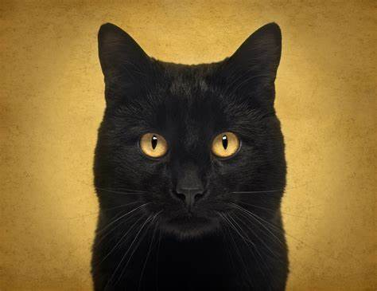
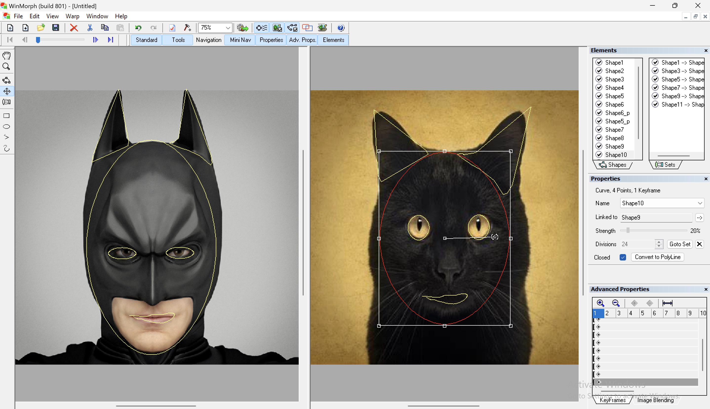

## Table of contents

## Introduction:

Morphing, a captivating process that facilitates a seamless transition between two images or sounds, is a fascinating aspect of digital art and multimedia. In this article, we explore the fundamental concepts of morphing, particularly focusing on image transformation. This exploration will encompass the practical aspects of morphing using WinMorph, the importance of image selection, and the underlying principles of interpolation and spatial domain manipulation.

### Choosing Images for Morphing:

Careful consideration must be given to the selection of images. Using a camera or specialized software, two images suitable for morphing should be obtained. The images should share similar sizes, and orientations.

#### Understanding Morphing:

Morphing is not merely a transition; it involves a deliberate transformation of features from one image to another. It is, essentially, a form of metamorphosis. Interpolation plays a key role in morphing, allowing sensible predictions of missing data values.

#### Comparison with Tweening:

Tweening, a similar effect in animation using vector graphics, shares some principles with morphing. However, the crucial distinction lies in the data being manipulated. While morphing deals with the interpolation of pixel values, tweening involves the interpolation of properties in vector graphics, such as origin, radius, fill colour and line endpoints.

#### Examples:

1. I'll take this image as an example:

2. Another Image to make the morphing interesting:

3. After Morphing James Bond into the Duck the result is:

<video width="550" height="340" style="width: 700px" controls>
  <source src="/blogs/understanding-morphing-image-transformation/1.mp4" type="video/mp4">
  Your browser does not support the video tag.
</video>

---

4. Another Image:

And morphing it with the image of this cat:

5. So using my trusty program "WinMorph" I open the images, And try to add the shapes to both images to match the face from the left image with the right image:

6. Then I render the morphing process, like this:

7.  I tried morphing it with my Batman image and got this result:

<video width="550" height="340" style="width: 700px" controls>
  <source src="/blogs/understanding-morphing-image-transformation/2.mp4" type="video/mp4">
  Your browser does not support the video tag.
</video>

---

#### Conclusion:

In conclusion, morphing is a captivating process that goes beyond simple transitions, offering a creative avenue for image transformation. By understanding interpolation, spatial domain manipulation, and the differences from tweening, individuals can harness the power of morphing to create visually stunning and artistically expressive works.

**References:**

- Harmandeep Singh. Sliet University. Sangrur, India, Amandeep Kumar Sliet University Sangrur, India Gurpreet Singh Punjabi University. (2014). IImage Morphing: A Literature Study. Publish on [ <a href="https://ijcatr.com/archives/volume3/issue11/ijcatr03111010.pdf" title="Morphing in Two Dimensions: Image Morphing" target="_blank" >https://ijcatr.com/archives/volume3/issue11/ijcatr03111010</a> ]

- Morphing in Two Dimensions: Image Morphing. (2007). Morphing in Two Dimensions: Image Morphing. Published on [ <a href="https://core.ac.uk/download/pdf/37321395.pdf" title="Morphing in Two Dimensions: Image Morphing" target="_blank" >"https://core.ac.uk/download/pdf/37321395</a> ]
