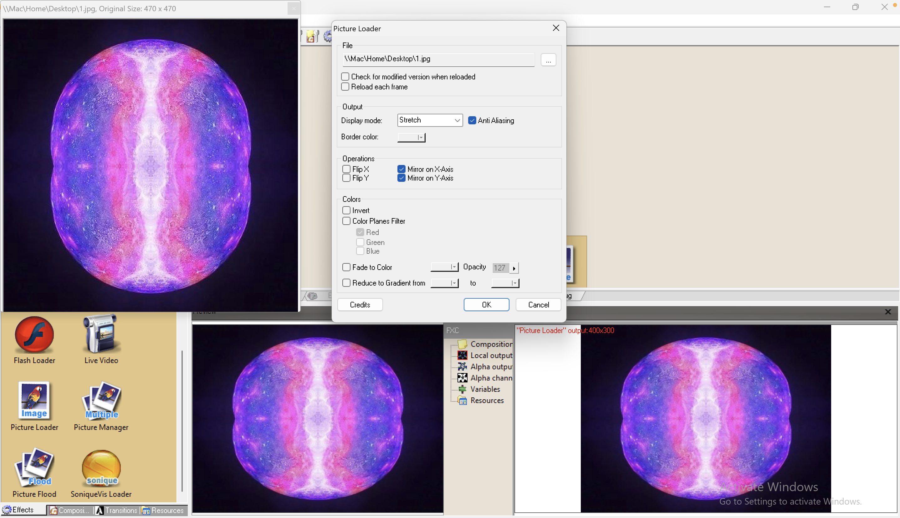
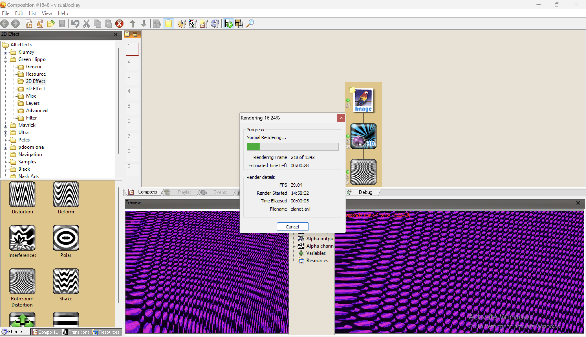
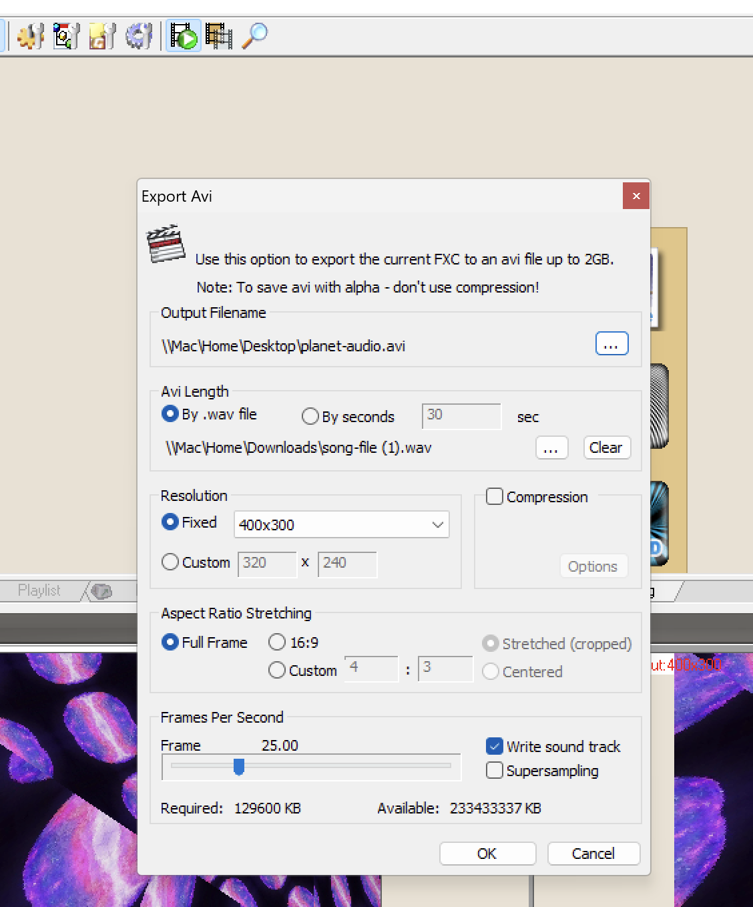

## Table of contents

## Picture Magic

Start simple by loading pictures. Think of it as the canvas for your visual masterpiece.

#### Layers of Wow

Layers make things fancy. It's like putting one picture on top of another for cool effects.

### Your Creative Playground

Time to make your own magic. Start with examples, tweak them, and save your work. Most importantly, enjoy the process!

### VJ: Beyond Visuals

#### Fun with Sound

Have you ever thought of making visuals dance to music? Imagine that! Play with tones and rhythms, it's like painting with sound.

#### No Limits

Explore and have fun. Use sensors, to make things interactive. It's your world; make it awesome!

### Visual Jockey: What's That?

#### Visual Jockey Fun

It's like being a DJ but with visuals – videos, images, all the cool stuff!

#### Free Tools!

Use free software. There are tutorials too, so no worries about where to start.

##### For example, I wish to create an interesting scene from this crystal:

1. This is my starting Image:

1. After dragging my handy tool (Picture Loader), I will be able to import my image to the canvas to apply visual Effects on it:

2. I added Some Effects so I can make my image interesting, the effects are:

- 2D Rotozoom Distortion
- 3D Effect Raytracing

So by just dragging the effects mentioned above, and use them in my "Composition", This is what it came out looking like:

3. After adding the effects, I can render it as a video from File -> Export Movie:
   

4. After Rendering it as a video this is what it looks like:

<video width="550" height="340" style="width: 700px" controls>
  <source src="/blogs/vj-effects-discovering-visual-creativity/1.mp4" type="video/mp4">
  Your browser does not support the video tag.
</video>

5. We can also use the power of Visual Jockey Software to use a sound and include it in my video from File -> Export Movie, and We need to check the write sound to track:

   

6. Here is the Rendered out put video after including the sound:

<video width="550" height="340" style="width: 700px" controls>
  <source src="/blogs/vj-effects-discovering-visual-creativity/2.mp4" type="video/mp4">
  Your browser does not support the video tag.
</video>

---

## Exploring Technical Aspects of Visual Jockeying

In this section, I talk about technical aspects of visual jockeying, including the features of sound for triggering effects, challenges of real-time video manipulation, and algorithms/processes for sound analysis.

### 1. Features of Sound for Triggering Effects in VJ

In visual jockey sound can make awesome visuals happen. Different sound features help sync visuals with audio, making and creating immersive experience for the crowd.

<u>**Amplitude**</u>: Sound strength can control visual brightness and size. For instance, louder sounds can mean brighter colors or bigger shapes.

<u>**Frequency**</u>: specific visual effects. High pitches can mean fast motion, while low pitches can mean slow movement.

<u>**Rhythm**</u>: The rhythmic of the music sets the pace for visual effects. Beat detection tech helps match visuals with the music's tempo.

### 2. Challenges of Real-Time Video Manipulation

Changing videos in real-time in visual jockey has some tough parts. VJs need to fix these to give smooth and awesome shows.

<u>**Processing Power**</u>: Performing complex and doing cool visual tricks live needs lots of computer power. VJs struggle with this, especially when using many effects at once.

<u>**Latency**</u>: It is important to reduce delay for sound and visuals to be in sync. Delays can make the show feel off, so it's important to set up software and hardware well.

<u>**Synchronization**</u>: ensuring the visuals and music go together is key. VJs find it hard to line up visuals with the music, especially in lively shows.

### 3. Algorithms/Processes for Sound Analysis

Sound analysis plays a crucial role in extracting meaningful data from audio sources to drive visual effects in VJ performances.

<u>**FFT (Fast Fourier Transform)**</u>: FFT breaks down sound into its frequencies. VJs use it to find main frequencies and change visual stuff based on them. is used for frequency analysis, decomposing audio signals into their constituent frequencies. VJs leverage FFT to detect dominant frequencies and adjust visual parameters accordingly.

<u>**Onset Detection**</u>: This spots sudden changes in the music, like drum hits. By finding these, VJs can match visuals to the music's rhythm.

<u>**Audio Feature Extraction**</u>: VJs use different ways to study sound, like its tone and styles. These give good info for making sweet visual shows in VJ.

---

### **References**

1. Hook, J., Green, D., McCarthy, J., Taylor, S., Wright, P., & Olivier, P. (2016). A VJ Centered Exploration of Expressive Interaction. Culture Lab, School of Computing Science, Newcastle University, UK; People and Technology, Dept. of Applied Psychology, University College Cork, Ireland; Socio-Digital Systems, Microsoft Research Cambridge, Cambridge, UK. Retrieved from Published on [ <a href="https://www.microsoft.com/en-us/research/wp-content/uploads/2016/02/VJ20CHI20201120v2032028Camera20Ready29.pdf" title="VJ Effects: Discovering Visual Creativity" target="_blank" >https://www.microsoft.com/en-us/research/wp-content/uploads/2016/02/VJ20CHI20201120v2032028Camera20Ready29.pdf</a>]
